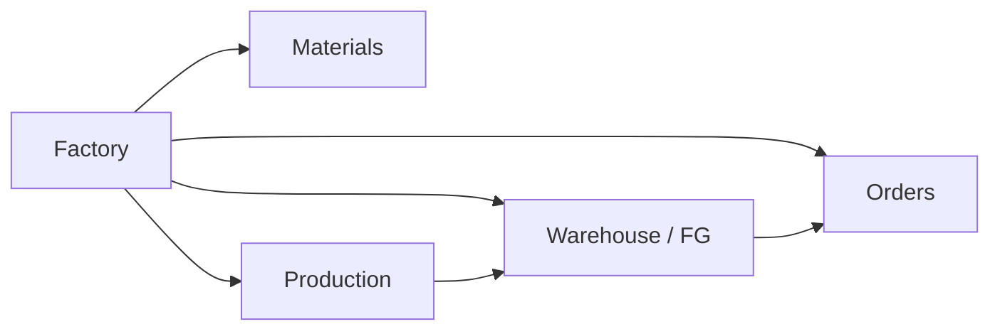
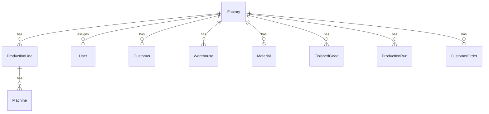
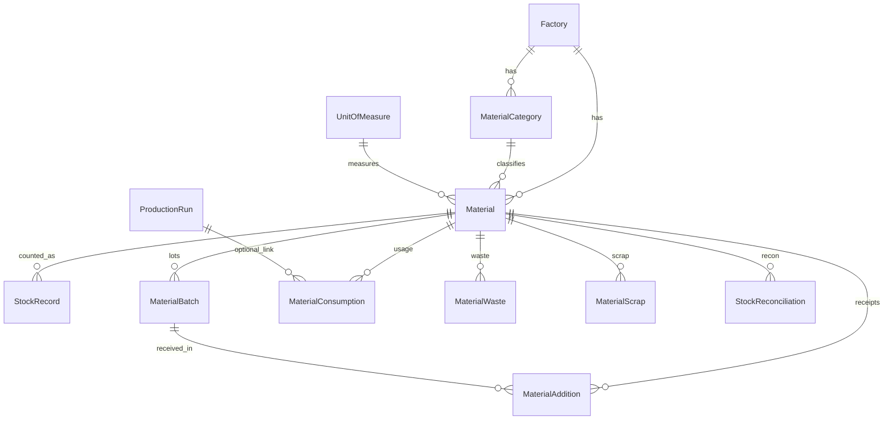
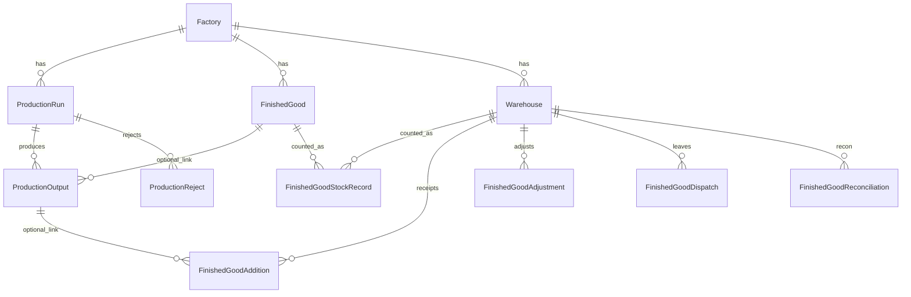
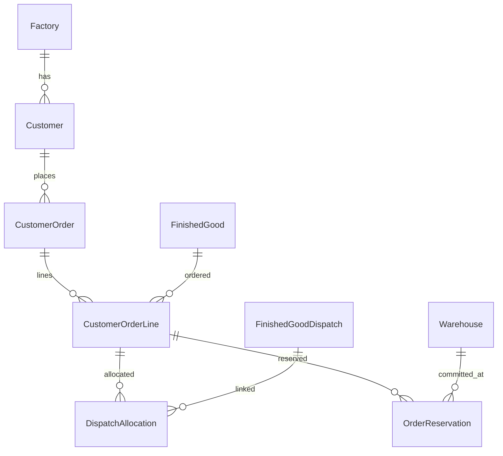

# FactoryOps — ERD (v1 Pilot)

Logical model only. Quantities are `Decimal(12,3)`. Most operational FKs use `PROTECT`. Unique keys are factory-scoped unless noted.

## Domain flow

## Factories and people

## Materials

**StockRecord** unique on `(factory, material, recording_date)`. Closing quantity may be blank until counted.

**StockReconciliation** unique on `(factory, material, reconciliation_date)`. Result fields stay null until `calculate()`.

## Production and warehouse

**Warehouse** code unique per factory (`FG-MAIN`, `FG-STORE`, `FG-HOLDING`).

**FinishedGoodStockRecord** unique on `(warehouse, finished_good, recording_date)`.

**FinishedGoodAdjustment** quantity is always positive; direction is `INCREASE` or `DECREASE`.

**FinishedGoodDispatch** is “left inventory”, not a sale.

## Orders

**CustomerOrder** has two independent statuses:

- `status` — commercial (`OPEN`, `PARTIALLY_ALLOCATED`, `ALLOCATED`, `CANCELLED`)
- `fulfilment_status` — physical (`UNFULFILLED`, `PARTIALLY_FULFILLED`, `FULFILLED`), updated only by `calculate_fulfilment()`

**OrderReservation** does not reduce stock and does not create a dispatch.

## Cardinality notes

| Relationship | Rule |
|---|---|
| Material code | Unique per factory |
| Customer code | Unique per factory |
| Order reference | Unique per factory |
| Production run reference | Unique per factory |
| Finished-good code | Unique per factory |
| Warehouse code | Unique per factory |
| Batch lot | Unique per material |
| Same dispatch / line | Multiple allocation rows allowed (history) |
| Same warehouse / line | Multiple reservation rows allowed (history) |

There is **no** `Material.current_quantity` or `FinishedGood.current_quantity`.
